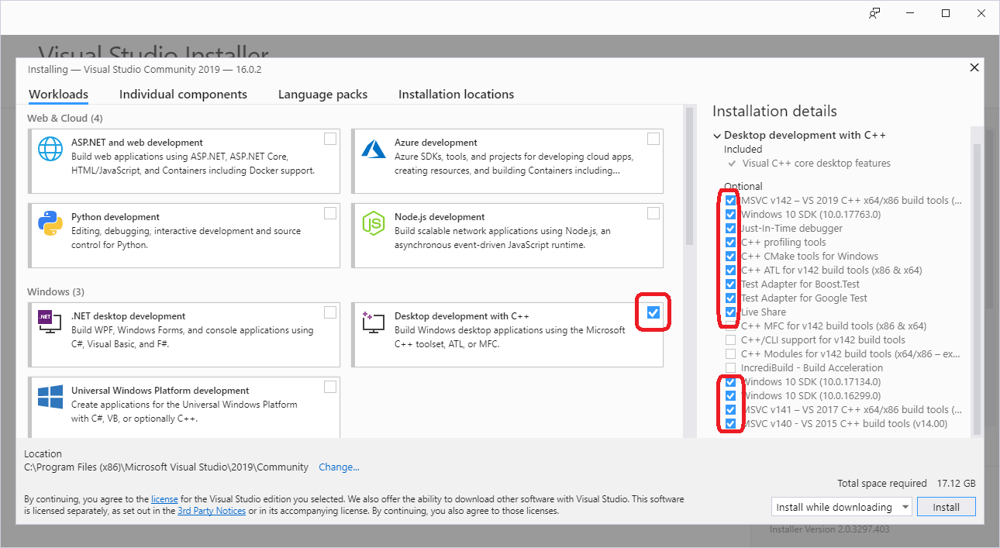

# Visual-Hoax-for-UEFI-Shell

## Goal
Demonstration of how to implement hoax software tools to access
the Intel BayTrail (BYT) platform hardware or data structures directly or
by UEFI API.

The projects are kept small and simple to introduce the UEFI shell
programming using "ANSI C", easily and quickly.

## Approach
It is intended to use Visual Studio 2019 as the only development environment.
Furthermore it is intended to use ANSI-C library functions as far as possible.

Doing so, the UEFI Shell applications can be easily debugged
on the Windows development platform, simply by building the sourcecode
as a Win64-executable (change the solution configuration from Efi64 to Win64 ).

## HowTo
1. download VS2019 from here: https://visualstudio.microsoft.com/downloads/
2. select: "Desktop development with C++"
		
3. after installation is finished, open _Visual-Hoax-for-UEFI-Shell.sln_
4. adjust the Windows SDK version: _Project->Retarget Solution_

## Revision history
### 20190423 - initial revision
* MinnowBlink182 -- LED blink program on MinnowBoard

